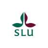

## Unit Diadromous Species; Department of Aquatic Resources; Swedish university of agrucultural sciences

The Unit Diadromous Species works mainly with research and monitoring of eel, salmon och anadromous trout.
This is our github for tools and software developed at Unit Diadromous Species. Most of the things you find here is only of interest for our internal work.

