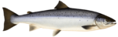

## Unit Salmonids; Department of Aquatic Resources; Swedish university of agrucultural sciences

The Salmonids unit at Department of Aquatic Resources is responsible for environmental monitoring
and research on salmonids, mainly salmon och anadromous trout.
This is our github for tools and software developed at Salmonids unit. Most of the
things you find here is only of interest for our internal work.

